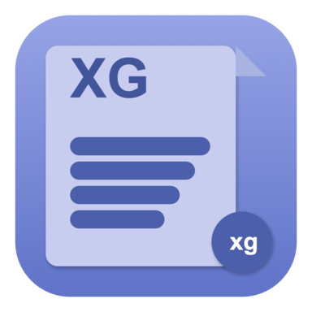

# XGBoard

Gerenciador de área de transferência nativo para macOS, no estilo Win+V do Windows.

<div align="center">



[](https://www.apple.com/macos/)
[](https://swift.org/)
[](LICENSE)

</div>

---

## Recursos

- Atalho global **Cmd+Shift+V** (configurável). Implementado com Carbon `RegisterEventHotKey`, **não exige permissão de Acessibilidade** e funciona desde o login.
- Picker compacto estilo Spotlight (`NSPanel` borderless com vibrancy `NSVisualEffectView`), aberto no cursor.
- Suporte a texto, imagens, RTF e arquivos.
- Busca em tempo real e favoritos.
- Histórico configurável (padrão: 500 itens; 10–2000).
- Persistência em `~/Library/Application Support/XGBoard/` com limite de 200 MB e LRU (favoritos preservados).
- Deduplicação por SHA-256: copiar o mesmo conteúdo não duplica entradas.
- Apenas uma representação por copy (uma imagem com 3 formatos não vira 3 entradas).
- Aparência nativa com material `.popover`, cantos arredondados, sombra e fechamento automático ao perder foco.

---

## Como usar

| Atalho | Ação |
|--------|------|
| `Cmd+Shift+V` | Abre o picker no cursor |
| `↑` / `↓` | Navega na lista |
| `↩` ou clique | Copia o item selecionado e fecha |
| `⎋` ou clique fora | Fecha sem copiar |
| Clique direito | Favoritar / apagar |

Atalho configurável em **Configurações → Atalho Global** (gravador de combinação).

---

## Instalação

### A partir do código (uso local)

```bash
git clone https://github.com/xulioguimaraes/XGBoard.git
cd XGBoard
./scripts/build_simple.sh
./clean_install.sh
```

`clean_install.sh` encerra processos do XGBoard, reseta o TCC do bundle, copia o `.app` para `/Applications` e abre.

### A partir de instalador

- **DMG**: `XGBoard-v2.0-Installer.dmg` (gerado por `./scripts/build_dmg.sh`) — arraste para Applications.
- **ZIP**: `XGBoard-v2.0-macOS.zip` (gerado por `./scripts/build_distribution.sh`) — extrair e mover para Applications.

> Builds não assinados (sem Apple Developer ID) podem mostrar o aviso de "app de desenvolvedor não identificado" na primeira execução. Para abrir mesmo assim: `Configurações do Sistema → Privacidade e Segurança → Abrir mesmo assim`.

### Atalho global

A partir da v2, o atalho global usa Carbon e funciona sem nenhuma permissão. Não é necessário ir em "Acessibilidade" — basta abrir o app uma vez.

---

## Configurações

Disponíveis em **Configurações** (item da barra de status):

- Número máximo de itens no histórico (10–2000)
- Intervalo de monitoramento da área de transferência (0.1 / 0.5 / 1.0 s)
- Atalho global (gravar combinação personalizada)
- Tema (claro / escuro)
- Iniciar automaticamente ao login

---

## Para desenvolvedores

### Build

```bash
# Menu interativo
./build_app.sh

# Ou diretamente:
./scripts/build_simple.sh         # .app em build/ (uso local)
./scripts/build_distribution.sh   # .zip para distribuir
./scripts/build_dmg.sh            # instalador DMG (requer brew install create-dmg)
./scripts/build_professional.sh   # com assinatura Developer ID (requer Apple Developer Account)
```

### Estrutura

```
ClipboardManager/
  ClipboardManagerApp.swift   AppDelegate, status bar, NSPanel manager
  ContentView.swift           Picker compacto (lista + busca + footer)
  ClipboardMonitor.swift      Singleton, polling NSPasteboard, dedup por SHA-256
  ClipboardStore.swift        Persistência em Application Support + migração
  ClipboardItem.swift         Modelo de dados
  HotKeyManager.swift         Carbon RegisterEventHotKey
  SettingsView.swift          Configurações + gravador de atalho
Resources/                    Ícones e assets
scripts/                      Scripts de build
clean_install.sh              Instalação limpa (kill + tccutil reset + copy)
CHANGELOG.md                  Histórico de versões
```

### Stack

- Swift 5.0, SwiftUI + AppKit
- macOS 13.0+ (target)
- Sem dependências externas (apenas frameworks do sistema)
- Carbon HIToolbox para atalho global
- ServiceManagement (SMAppService) para login item
- CryptoKit para hash de deduplicação

---

## Changelog

Ver [CHANGELOG.md](CHANGELOG.md).

---

## Licença

MIT — ver [LICENSE](LICENSE).
